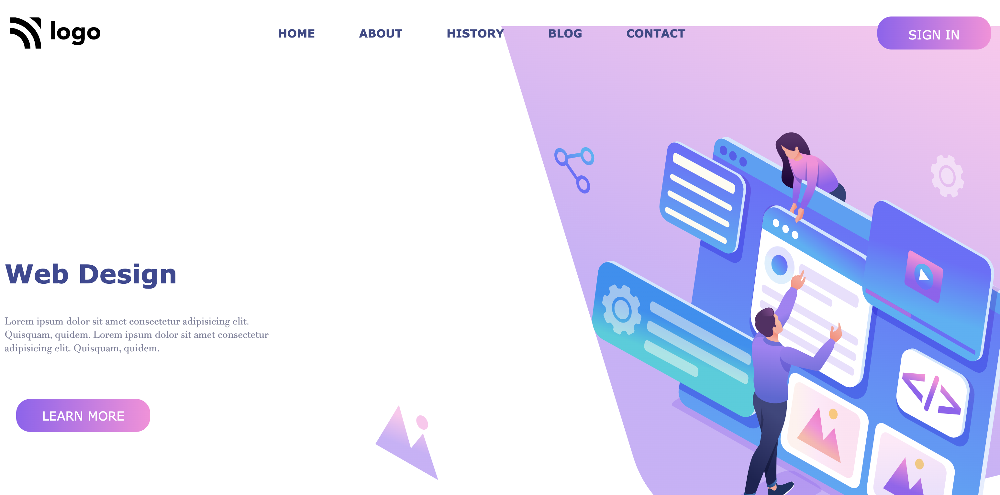

**Web Design Landing Page**
--------------------------------------
-----------------------------------------
   

[Deployed Link](https://web-design-landing-page-by-hs.netlify.app/)

What I learned from this Project?

- Learned how to use **HTML** and **CSS** to create a beautiful website.
- Implemented adding background image with background-repeat,position and size property.
- Implemented adding background color using linear-gradient property.
- Used CSS positioning property.
- Learned and implemented class, tag based selection of HTML elements.
- Implemented media queries to make the webpage responsive for other devices too.

